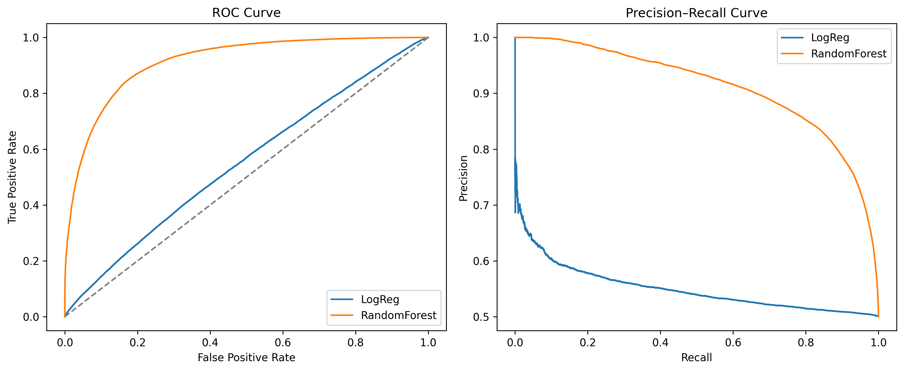
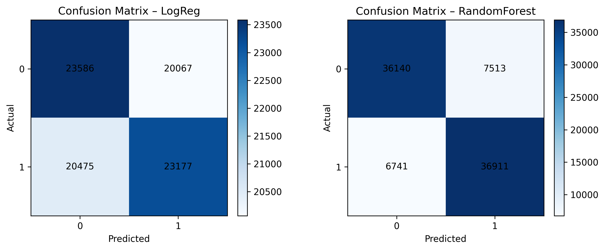
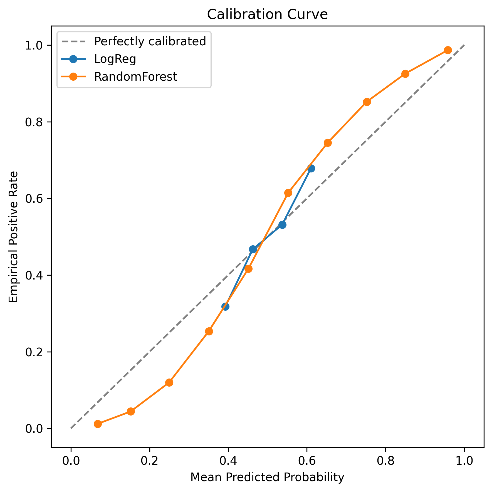
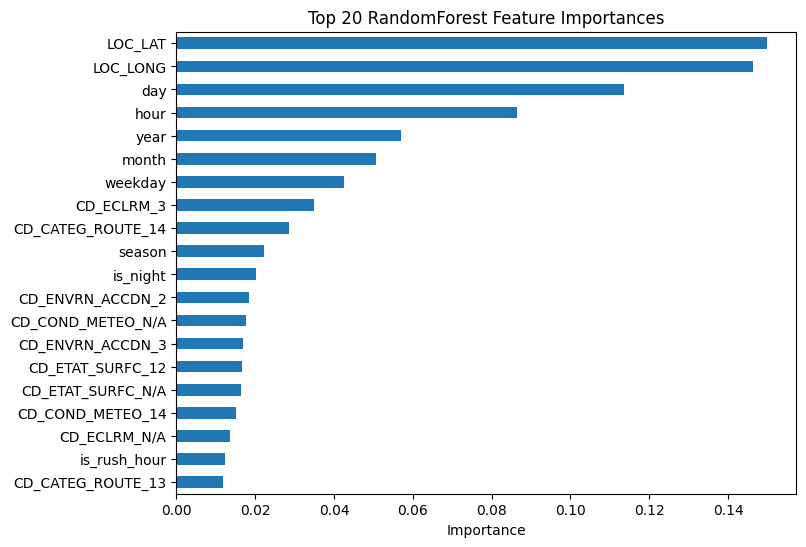

# Montreal Collision Severity Project
This project investigates whether **machine learning models** can predict road collisions in Montréal using **200K+ real-world traffic reports**. By modeling the relationship between road conditions, time, and location, the project highlights high-risk areas and time periods, offering insights that can support urban planning and public safety interventions.

The pipeline integrates spatial, temporal, and contextual features (engineered with OSMnx and domain knowledge) to model collision risk. Logistic Regression serves as a baseline, while Random Forest achieves **91% AUROC**, significantly outperforming baseline methods.

---
## Repository Structure

- **data/** — raw and processed datasets (CSV, Parquet)  
- **exploration/** — exploratory scripts and data understanding  
- **reports/figures/** — saved plots and visualizations  
- **src/** — reusable source code  
  - `data_preparation.py` — preprocessing and feature engineering  
  - `modeling.py` — training, evaluation, and model comparison  
  - `utils_io.py` — helper functions for loading/saving data  
- **requirements.txt** — list of Python dependencies  
- **README.md** — project overview and results

---

## How to Run  

First install the dependencies listed in `requirements.txt`, you can run the data preparation and modeling scripts in `src/` to regenerate the processed dataset, train the models, and reproduce all the evaluation figures in `reports/figures/`.  

---
## 📊 Results

### Geospatial Visualization
Historical collision density across Montréal (200K+ reports).  
This highlights high-risk areas such as downtown Montréal and major intersections.  

  

👉 [View interactive version (HTML)](reports/figures/collision_heatmap.html)

---

### Model Evaluation

**ROC & Precision–Recall Curves**  

**Confusion Matrices**  

**Calibration Curve**  

**Top Feature Importances**  

---

## Technical Details
- **Language & Libraries**: Python, scikit-learn, pandas, numpy, matplotlib, OSMnx, Folium  
- **Models**: Logistic Regression, Random Forest  
- **Evaluation Metrics**: ROC-AUC, PR-AUC, Calibration, Confusion Matrices  
- **Features**:  
  - Temporal (hour, day, month, weekday, season, rush hour, is_night)  
  - Spatial (latitude, longitude, route categories)  
  - Contextual (environment, road conditions, weather, etc.)  

---

## 🚧 Ongoing Work
- Extending geospatial visualization to **predicted risk maps** (model-based, not just historical).  
- Adding temporal layers (e.g., rush hour vs late night, seasonal trends).  
- Experimenting with deep learning models for spatio-temporal prediction.  
- Possible deployment via Streamlit/Dash for interactive exploration.  

---

##  Status
This is an **ongoing project**. Current focus is on robust evaluation and exploratory visualization; extensions to deployment and predictive risk mapping are planned.  

